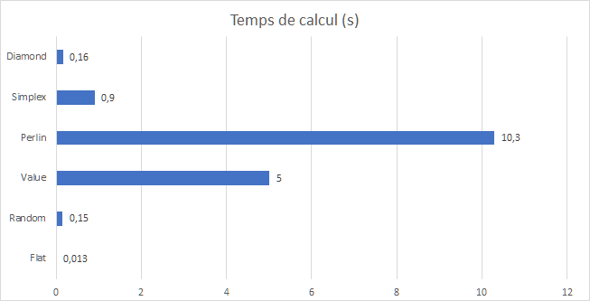

# AGAT

[](https://creativecommons.org/licenses/by/4.0/)
[](https://travis-ci.org/arnaudgregoire/AGAT)

Algorithmes de Génération Aléatoires de Terrains

## Introduction

Le projet AGAT est en intégration continue avec Travis.
Les instructions suivantes vous donneront un ordre d'idée des capacités de la librairie AGAT et de comment les utiliser. Tous les morceaux de codes présentés dans cette documentation utilisateur sont éxécutés à chaque lecture des tests unitaires. Leurs résultats est enregistré dans le dossier data.


### Installation

La librarie fonctionne avec Maven. Il faut donc que Maven soit installé. De plus, un Java Runtime Environnement (JRE 8 ou plus récent) est requis. Pour installer Maven, faire

```sh
sudo apt install maven
```
Pour compiler le projet, on lance Maven avec la commande "install" à la racine du répertoire AGAT (là où se situe le pom.xml

```sh
mvn install
```
Une connection internet sera aussi nécessaire pour télécharger les dépendances.


### Ajouter AGAT à votre projet

Pour inclure AGAT à votre projet, ajouter une dépendance dans le pom.xml

```xml
<dependency>
  <groupId>eu.ensg.tsi</groupId>
  <artifactId>agat</artifactId>
  <version>0.0.1-SNAPSHOT</version>
</dependency>
```
AGAT est désormais à votre service.
Remarque : Les MNT que vous génererez seront stockés dans un sous dossier data. Soyez sur d'en avoir un dans votre projet avant d'enregistrer des fichier.
 

### Premier MNT

Voici un exemple tout simple générant un premier MNT.

```java
Map map = new Map("simplex");
map.generate();
map.exportToGeoTiff("testSimplex");
```

Ce script créé un MNT puis le stocke dans le fichier ./data/testSimplex.tiff.  

## Personaliser sa map

### Changer l'emprise

L'emprise par défaut va du point (0,0) au point (100,100).
Il y a plusieurs façons de modifier l'emprise d'une map. On peut le faire à la main en définissant une nouvelle emprise à l'aide de 2 points :
 
 - le point en bas à gauche 
 - le point en haut à droite
 
 ce qui nous donne :

```java
Map map = new Map("simplex");
map.setBound(new Bound( new Point(0,0) , new Point(300,200) )); 
map.generate();
map.exportToGeoTiff("testChangeEmprise");
```

La librarie propose aussi d'importer l'emprise d'un shapefile, son utilisation est détaillé dans la partie Import/Export. 

### Changer la résolution

AGAT propose à ses utilisateurs de changer la résolution d'une map. Par défaut, la résolution de toutes les maps est fixé à 1 (l'unité dépend de la projection utilisé).

```java
Map map = new Map("value");
map.setResolution(2);
map.generate();
map.exportToGeoTiff("testChangeResolution");
```

Plus la résolution sera précise, plus la taille de la carte sera lourde. Pour éviter ce problème, la librairie propose à ces utilisateurs une résolution conseillé :

```java
Map map = new Map("perlin");
map.setResolution(map.getAdvisedResolution());
map.generate();
map.exportToGeoTiff("testAdvisedResolution");
```

La résolution sera alors de la longeur du plus petit coté de l'emprise /100.

### Changer l'amplitude

Par défaut, toutes les valeurs générés qui composent le MNT sont comprises entre 0 et 1. L'utilisateur peut réétaler les valeurs entre 0 et 
l'altitude maximum voulu.

```java
Map map = new Map("diamond");
map.generate();
map.resize(255); //altitude max souhaité
map.exportToGeoTiff("testresize");
```

### Changer le système de projection

Par défaut, le système de projection utilisé est le Lambert 93 (EPSG:2154), il est possible cependant de travailler avec d'autres projections, pour peu que l'on connaisse son identifiant EPSG.

```java
Map map = new Map("value");
map.setCrs(4326);
map.generate();
map.exportToGeoTiff("testChangeEPSG");
```
		
### Changer la méthode de génération

La librairie implémente plusieurs algorithmes de générations tous différents. Pour en sélectionner un, les mots-clés correspodant aux différents types de générations peuvent être utilisés. 
 
  - "simplex" : bruit de simplex
  - "perlin" : bruit de Perlin
  - "random" : bruit blanc
  - "value" : bruit de valeurs
  - "flat" : valeurs uniformes
  - "diamond" : algorithme diamond square
  
Remarque : L'algoritme de Diamond Square ne marche que sur des maps carrés avec (2 ^ n) + 1 points de coté. L'emprise par défaut pour une map diamond square est donc 129*129. Si l'emprise définit par l'utilisateur ne correspond à ces critères, la méthode generate() renverra une MapNotElligibleToDiamondSquareException. 	


### Configurer les algorithmes de générations

Pour les utilisateurs s'y connaissant en générations aléatoires, il est possible de personnaliser les paramètres de générations des différents algorithmes. Les méthodes configurables sont le bruit de simplex, value, perlin. Elles prennent en paramètre :

 - 1er paramètre : Le pas, il doit être de la taille comparable aux nombres de points d'un coté de l'emprise du MNT. Il est fixé par défaut à 1/3 de la longueur du plus petit coté de l'emprise de la map.
 - 2e paramètre : Le nombre d'octaves, il correspond aux nombres de bruis sommés, plus il est élevé, plus le terrain sera granuleux, il est compris entre 1 et 13 (au dela, possiblité de JavaOutOfMemoryException). Par défaut, le nombre d'octaves est 6.
 - 3e paramètre : La persistence : le facteur avec lequel on multiplie chaque octave. La persistence est compris entre 0 et 1. Plus elle est élevée, plus le terrain sera cohérent. Par défaut, la persistence est réglé à 0.4.


```java
Map map = new Map("random");
map.setGenerator(new GeneratorValueNoise(10, 7, 0.3)); // On change de la méthode de génération de random à value
map.generate();
map.exportToGeoTiff("testChangeGenerator");
```

## Import / Export

### Exporter sa map

La librairie permet d'exporter des MNT au format 

```java
Map map = new Map("simplex");
map.generate();
map.exportToGeoTiff("testSimplex");
map.exportToASC("testSimplex");
```

Ce script créé un MNT et l'enregistre 2 fois dans le sous dossier data:
 
  - une premiére fois au format Geotiff
  - une seconde fois au format ASC
  
Remarque : l'export au format ASC est sensiblement plus long car non optimisable ( il est écrit avec des libraries bas niveaux I/O). Préférez donc l'export au format geotiff pour de meilleurs performances.   

### Importer une emprise depuis un fichier vecteur

On peut charger l'emprise d'un fichier shp pour générer un MNT de la zone. 
Si l'identifiant EPSG du shapefile ne correspond pas à celui de l'objet Map (l'identifiant par défaut est EPSG:2154, projection Lambert 93), la fonction essaiera de créer l'emprise dans la projection associé au shapefile puis de la reprojeter dans la projection associé à l'objet Map.

```java
Map map = new Map("simplex");
map.importShapefileBound("shp/buffer_dissolve_paris.shp");
testMap.setResolution(testMap.getAdvisedResolution());
map.generate();
map.exportToGeoTiff("testParis");
```

Ici, on notera l'utilisation de la méthode getAdvisedResolution() qui permet simplement de renvoyer la valeur conseillé par la librarie pour effectuer la génération. En effet, si la résolution est trop élevée, la taille du fichier et les temps de calculs vont trés vite augmenter ( 45 secondes pour 100 000 000 de points avec la méthode de bruit simplex ).

### Importer une emprise depuis un fichier raster

Même chose que précédemment mais avec un raster.

```java
Map map = new Map("simplex");
map.importRasterBound("data/testParis.tiff");
map.setResolution(testMap.getAdvisedResolution());
map.generate();
map.exportToGeoTiff("testParis2");
```

## Test de vitesses

Voici un graphique représentant les différents temps de calculs des algorithmes. Ces tests ont été réalisés pour une map carré avec 2049 points de cotés, cela fait environ 4.2 Millions de points à calculer. 



On voit que l'algorithme de génération aléatoire cohérent le plus rapide est le diamond-square. Cependant, ce dernier ne peut générer que des maps carrés de dimension 2**n -1. L'algorithme de génération simplex reste donc le plus rapide dans les autres configurations.
On notera aussi que l'algorithme remplissant la map de valeurs aléatoires est 10 fois plus longs (0.150s) que l'algorithme remplissant la map avec des 1 (0.013s). Le temps de génération de nombres aléatoires n'est donc pas négligeable.

## Construit avec :

* [Geotools](http://www.dropwizard.io/1.0.2/docs/) - Boite à outils SIG 
* [Maven](http://www.geotools.org/) - Gestion des dépendances


## License

Ce projet est sous la license Creative Common BY - Voir le [LICENSE.md](LICENSE.md) pour plus de détails.

